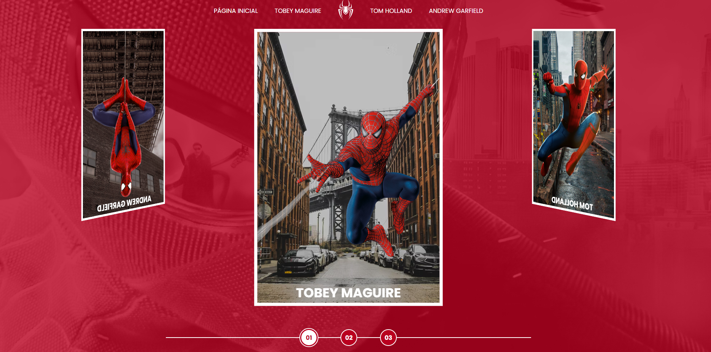

# Projeto Multiverso do Spider-Man

Este repositório abriga o projeto Multiverso do Spider-Man, desenvolvido como parte do curso da Digital Innovation One (DIO). O projeto consiste em uma aplicação web interativa que explora o conceito do multiverso do Homem-Aranha, permitindo aos usuários navegar por diferentes versões deste famoso super-herói e explorar seus respectivos universos.

## Funcionalidades Principais
- **Exploração Multiverso:** Navegação entre várias versões do Homem-Aranha, cada uma com sua própria história e características distintas.
- **Detalhes e Curiosidades:** Informações detalhadas sobre cada universo apresentado, incluindo curiosidades sobre personagens e enredos exclusivos.
- **Interação e Design Responsivo:** Desenvolvido utilizando HTML, CSS e JavaScript para proporcionar uma experiência imersiva e responsiva, adaptando-se a dispositivos móveis e desktops.

## Tecnologias Utilizadas
- **HTML:** Estruturação e marcação de conteúdo web.
- **CSS:** Estilização e design da interface do usuário.
- **JavaScript:** Implementação de lógica interativa e funcionalidades dinâmicas.

